# Отчёт по лабораторной работе №5

****Тема:**** Облачные базы данных. Amazon RDS, DynamoDB  
****Студент:**** Алина Гуцул  
****Дата:**** 23 февраля 2026

## 1\. Описание лабораторной работы

Лабораторная работа направлена на изучение облачных сервисов AWS, связанных с хранением и обработкой данных. Основное внимание уделяется работе с реляционными базами данных Amazon RDS (MySQL) и NoSQL-базой данных Amazon DynamoDB.

В рамках работы студент должен научиться:

-   Создавать и настраивать экземпляры реляционных баз данных в облаке AWS.
-   Создавать Read Replicas для повышения производительности и отказоустойчивости.
-   Подключаться к базам данных Amazon RDS с виртуальной машины EC2 и выполнять базовые операции CRUD (создание, чтение, обновление, удаление).
-   (Дополнительно) Ознакомиться с Amazon DynamoDB и реализовать базовые операции CRUD в NoSQL-среде.

## 2\. Постановка задачи

Необходимо выполнить следующие задачи:

1.  Подготовить виртуальную сеть (VPC) и группы безопасности для приложения и базы данных.
2.  Создать экземпляр базы данных Amazon RDS с MySQL, выполнить базовую настройку и подключиться к базе данных с EC2.
3.  Создать две таблицы с отношением один ко многим, вставить данные и выполнить запросы с JOIN.
4.  Создать Read Replica и проверить, как реплика синхронизируется с основной базой.
5.  (Дополнительно) Настроить мини-приложение или работу с Amazon DynamoDB.

## 3\. Цель и основные этапы работы

****Цель:****  
Освоить работу с облачными базами данных, понять концепцию Read Replicas и различия между реляционной и NoSQL-базой данных.

****Этапы работы:****

1.  Подготовка среды: создание VPC, подсетей и групп безопасности.
2.  Развёртывание Amazon RDS (MySQL) с настройкой параметров экземпляра.
3.  Развёртывание виртуальной машины EC2 и установка MySQL клиента.
4.  Подключение к базе данных и создание таблиц с тестовыми данными.
5.  Создание Read Replica и проверка её работы.
6.  (Дополнительно) Работа с Amazon DynamoDB через Python и библиотеку boto3.

## 4\. Практическая часть

### Шаг 1. Подготовка среды (VPC и группы безопасности)

-   Создана VPC `project-vpc` с двумя публичными и двумя приватными подсетями.
-   Созданы группы безопасности:
-   -   `web-security-group`: разрешён входящий трафик HTTP (порт 80) и SSH (порт 22).
    -   `db-mysql-security-group`: разрешён входящий MySQL трафик (порт 3306) только от `web-security-group`.
-   Настроен исходящий трафик из `web-security-group` к `db-mysql-security-group` для соединений к базе.
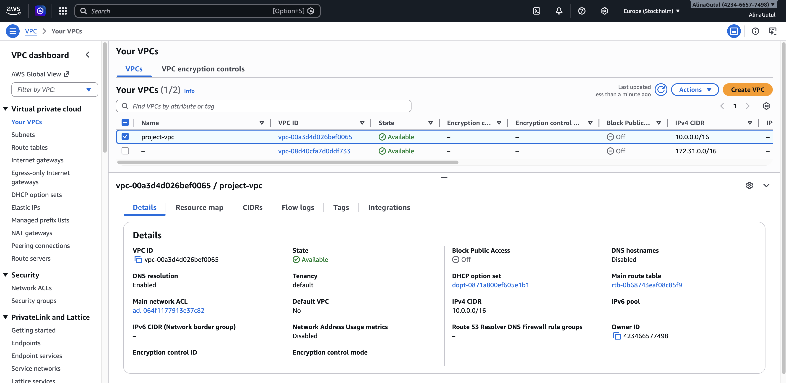
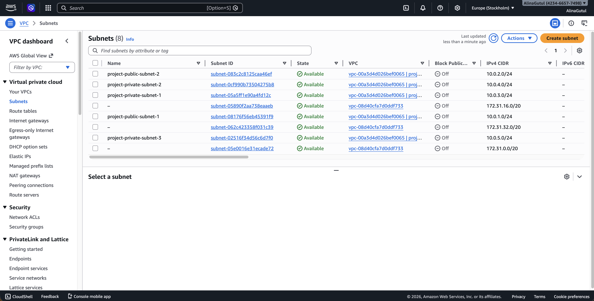
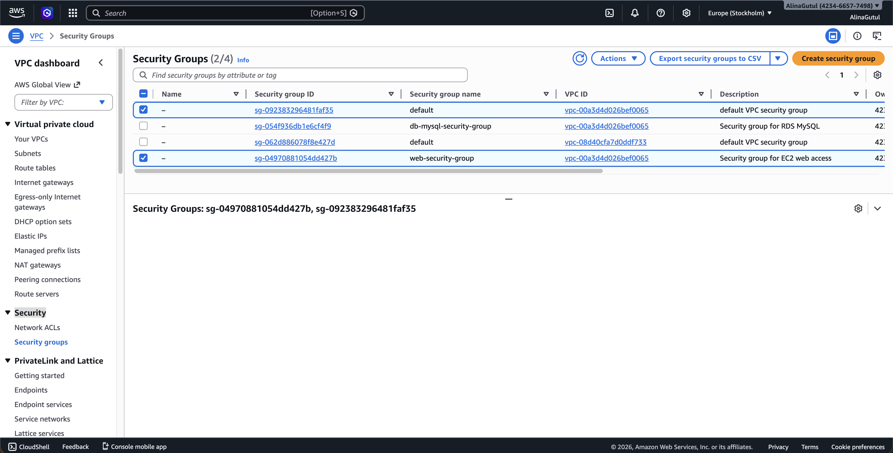
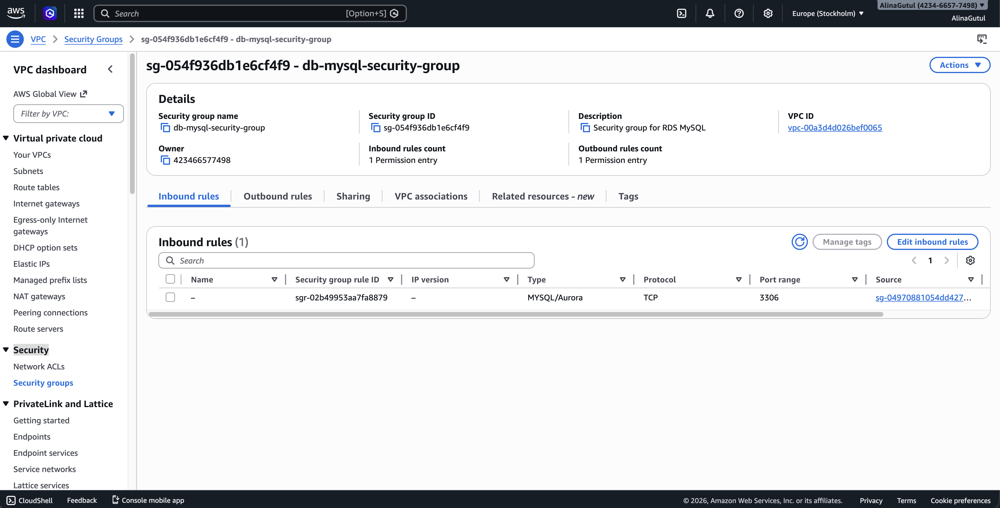
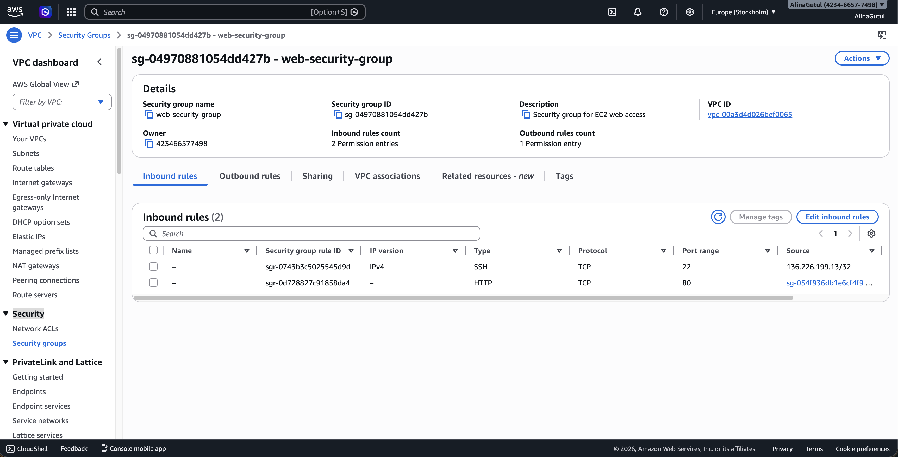

****Контрольный вопрос:****  
__Зачем нужны отдельные группы безопасности для приложения и базы данных?__

-   Это повышает безопасность, ограничивает доступ к базе данных только с ресурсов приложения.

### Шаг 2. Развёртывание Amazon RDS

1.  Создан Subnet Group `project-rds-subnet-group` для базы данных с двумя приватными подсетями.
2.  Создан экземпляр базы данных `project-rds-mysql-prod` с параметрами:
3.  -   Engine: MySQL 8.0
    -   Instance type: db.t3.micro
    -   Storage: gp3, 20 GB, с автоскейлингом до 100 GB
    -   Initial database name: `project_db`
    -   Public access: No
    -   Security group: `db-mysql-security-group`
4.  После завершения создания статус базы: ****Available****.
5.  Скопирован endpoint для подключения.
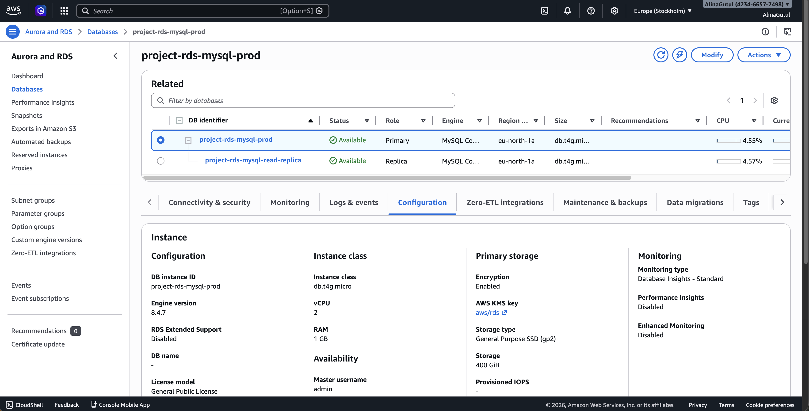

****Код подключения с EC2:****

mysql -h project-rds-mysql-prod.c7ycmcie6y1l.eu-north-1.rds.amazonaws.com -P 3306 -u admin -p  

### Шаг 3. Создание виртуальной машины EC2

-   EC2 развернута в публичной подсети VPC, с группой безопасности `web-security-group`.
-   Установлен MySQL клиент:

sudo dnf install -y mariadb105

****Контрольный вопрос:****  
__Зачем подключаться через EC2, а не напрямую с локального компьютера?__

-   Для безопасности: база в приватной подсети не имеет публичного IP.
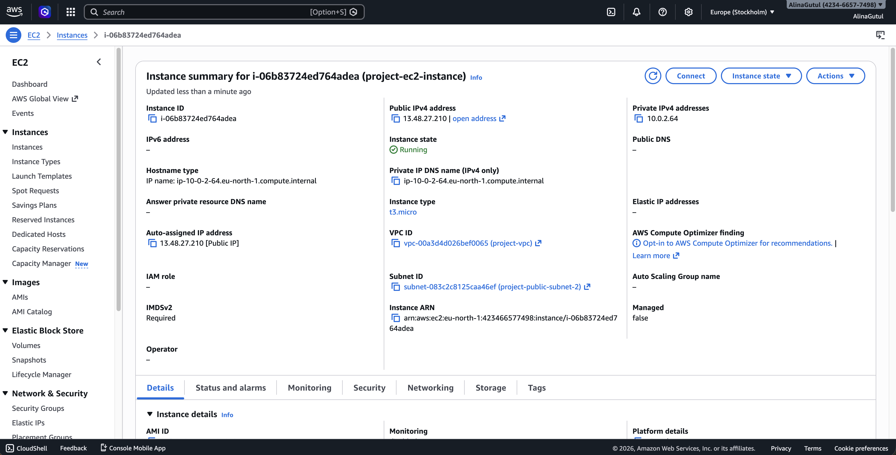
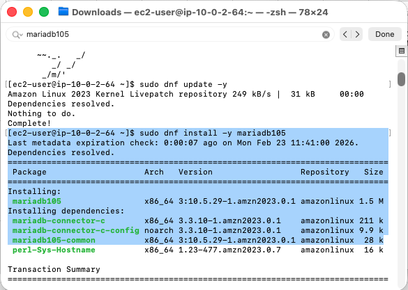

### Шаг 4. Подключение к базе данных и создание таблиц

Подключение к базе:

USE project\_db;  
  
CREATE TABLE categories (  
    id INT AUTO\_INCREMENT PRIMARY KEY,  
    name VARCHAR(50) NOT NULL  
);  
  
CREATE TABLE todos (  
    id INT AUTO\_INCREMENT PRIMARY KEY,  
    title VARCHAR(100) NOT NULL,  
    category\_id INT,  
    status VARCHAR(20),  
    FOREIGN KEY (category\_id) REFERENCES categories(id)  
);  
  
INSERT INTO categories (name) VALUES ('Work'), ('Study'), ('Hobby');  
INSERT INTO todos (title, category\_id, status) VALUES   
('Finish lab', 2, 'pending'),  
('Go to gym', 3, 'done'),  
('Deploy app', 1, 'in progress');  
  
SELECT t.title, c.name AS category  
FROM todos t  
JOIN categories c ON t.category\_id = c.id;  

****Результат:****  
Отображаются все задачи с соответствующими категориями.
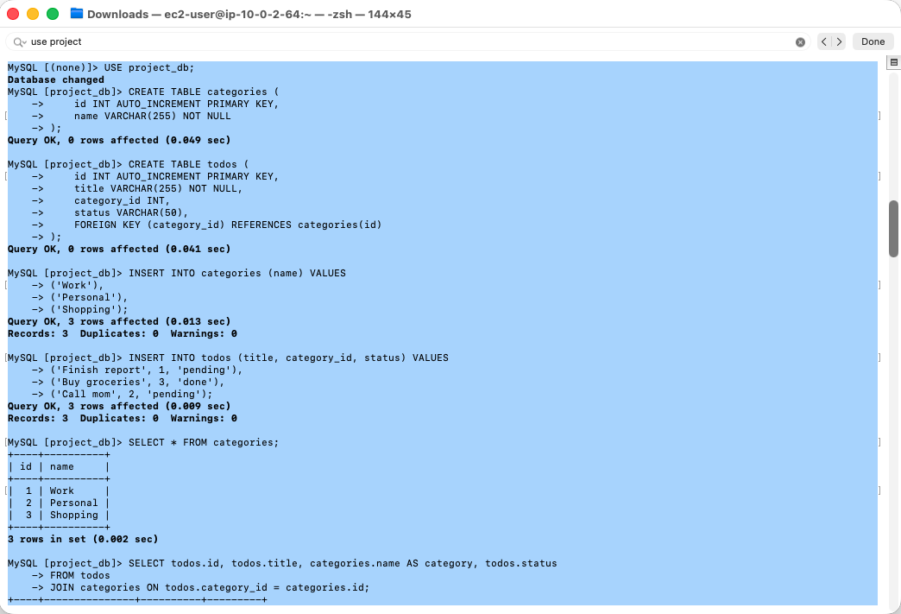

### Шаг 5. Создание Read Replica

1.  В консоли AWS выбрано ****Actions → Create read replica****.
2.  Настроено:
3.  -   Identifier: `project-rds-mysql-read-replica`
    -   Instance type: db.t3.micro
    -   Public access: No
    -   Security group: `db-mysql-security-group`
4.  Реплика создана, статус: ****Available****.

****Проверка работы реплики:****

mysql -h project-rds-mysql-read-replica.c7ycmcie6y1l.eu-north-1.rds.amazonaws.com -P 3306 -u admin -p  
USE project\_db;  
  
SELECT \* FROM todos;  

****Наблюдения:****

-   Данные читаются как с основной базы.
-   Попытка вставки (INSERT) на реплике: ****неудачна****, потому что Read Replica — только для чтения.
-   Добавление записи в основной базе автоматически отображается на реплике после синхронизации.

****Контрольный вопрос:****  
__Зачем нужны Read Replicas?__

-   Для масштабирования чтения, снижения нагрузки на основной экземпляр, обеспечения отказоустойчивости.
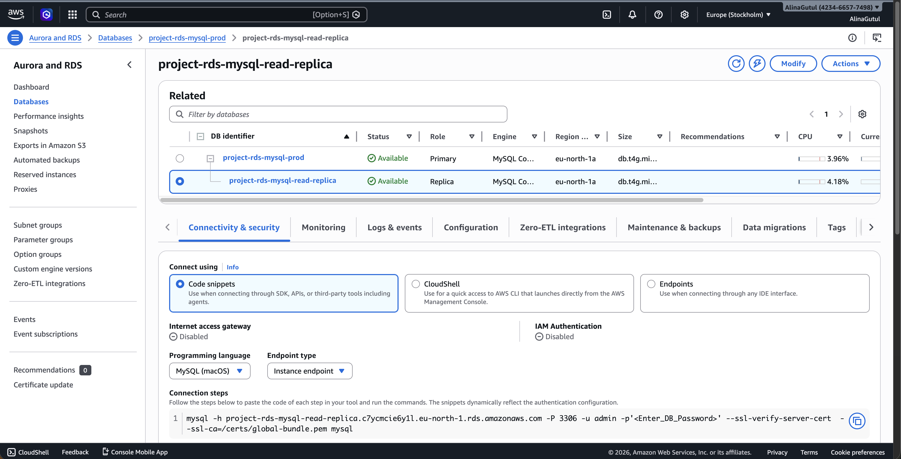
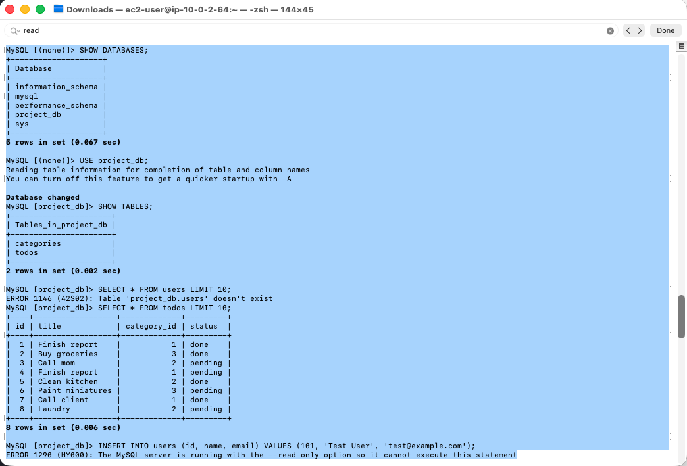

### Шаг 6. Дополнительно: Работа с Amazon DynamoDB

-   Установлен Python3 и библиотека boto3:

sudo dnf install -y python3 python3-pip  
pip3 install boto3  

-   Мини-скрипт Python для создания таблицы и вставки данных:

import boto3  
  
dynamodb = boto3.resource('dynamodb', region\_name='eu-north-1')  
  
table = dynamodb.create\_table(  
    TableName='Todos',  
    KeySchema=\[{'AttributeName': 'id', 'KeyType': 'HASH'}\],  
    AttributeDefinitions=\[{'AttributeName': 'id', 'AttributeType': 'N'}\],  
    ProvisionedThroughput={'ReadCapacityUnits': 5, 'WriteCapacityUnits': 5}  
)  
  
table.wait\_until\_exists()  
table.put\_item(Item={'id': 1, 'title': 'Finish lab', 'status': 'pending'})  
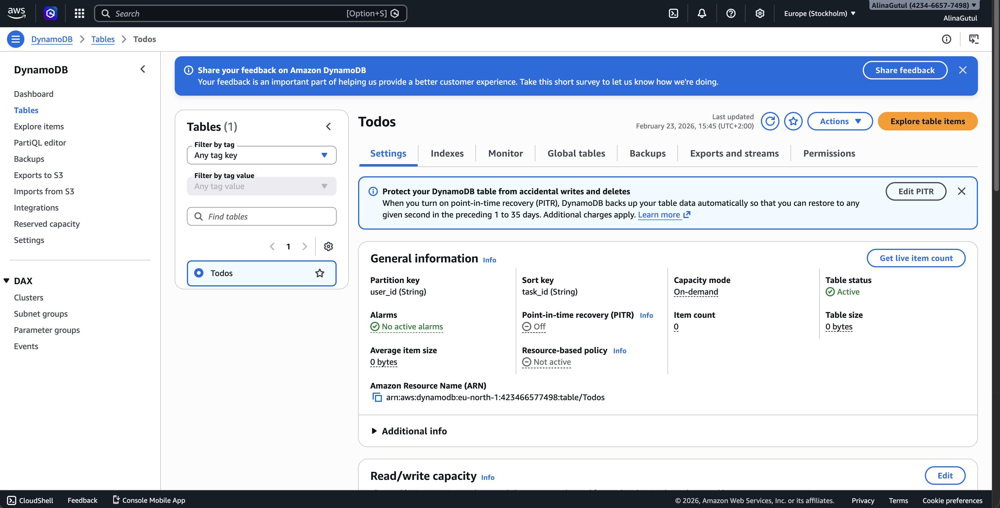

****Контрольный вопрос:****  
__Преимущества DynamoDB:__ масштабируемость, высокая скорость чтения/записи.  
__Недостатки:__ нет сложных JOIN, ограниченная гибкость по сравнению с реляционными базами.

## 5\. Список использованных источников

1.  AWS Documentation: Amazon RDS — [https://docs.aws.amazon.com/rds](https://docs.aws.amazon.com/rds)
2.  AWS Documentation: Amazon DynamoDB — [https://docs.aws.amazon.com/dynamodb](https://docs.aws.amazon.com/dynamodb)
3.  MariaDB Documentation — [https://mariadb.com/docs](https://mariadb.com/docs)
4.  Python boto3 Documentation — [https://boto3.amazonaws.com](https://boto3.amazonaws.com/)

## 6\. Вывод

В ходе лабораторной работы:

-   Развернуты облачные реляционные базы данных с помощью Amazon RDS.
-   Созданы таблицы с отношением один ко многим, выполнены операции CRUD.
-   Настроена Read Replica, продемонстрировано чтение данных с реплики и невозможность записи.
-   Освоена работа с Amazon DynamoDB через Python, добавлены базовые записи в NoSQL таблицу.

Работа позволила на практике изучить масштабируемость, безопасность и возможности AWS по работе с базами данных.